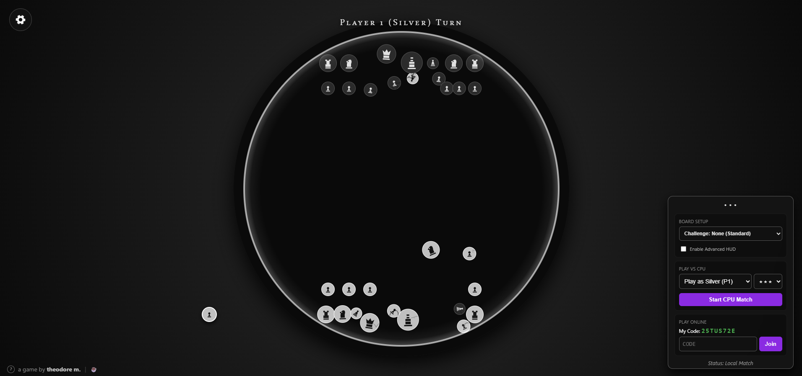

# ♟️ Shess: Physics-Based Sliding Chess

**Shess** is a high-impact, physics-driven twist on traditional chess. Instead of moving pieces to static squares, you calculate trajectories, manage momentum, and flick your pieces across a circular dohyō (arena) to knock the opponent's King out of bounds. It's what happens when chess meets billiards, shuffleboard, and sumo wrestling.

## ✨ Features

* **Physics-Driven Gameplay:** Powered by a custom `Matter.js` integration. Pieces possess mass, friction, and restitution. A heavy Rook hits like a truck, while a light Bishop glances off targets.
* **Online Multiplayer (No Server Required):** Seamless peer-to-peer online play using `PeerJS` and WebRTC. Generate a room code, send it to a friend, and play instantly.
* **Advanced CPU AI:** Practice against an AI that calculates trajectories, values pieces, and executes kinetic attacks based on a custom Minimax depth-simulation engine.
* **Deep Customization:** Open the hood and tweak the physics engine in real-time. Adjust the mass, friction, bounce, and drag of any piece, or load wild presets like "Ice Rink," "Glass Cannons," or "Sumo."
* **"Juicy" Visuals & Audio:** Features procedural shatter animations, kinetic shockwaves, and dynamic audio scaling based on impact velocity. 

## 🎮 How to Play

1. **Aim:** Click and drag backward from any of your pieces to aim, much like a slingshot.
2. **Flick:** Release to apply physical force to the piece. 
3. **Win:** Knock the enemy King completely out of the arena bounds or shatter it. 
4. **Special Rules:** * **Knights** can hop over pieces.
   * **Pawns** can promote to any other piece if they reach the far edge of the arena.

## 🛠️ Technical Stack

Shess is a purely client-side static web application. It requires no backend server or database to run or host multiplayer matches.

* **Frontend:** HTML5 Canvas, CSS3, Vanilla JavaScript
* **Physics Engine:** [Matter.js](https://brm.io/matter-js/)
* **Networking:** [PeerJS](https://peerjs.com/) (WebRTC Data Channels)

## 🚀 Local Development & Hosting

Because the game is entirely client-side, running it locally is incredibly simple:

1. Clone or download this repository.
2. Open `index.html` in any modern web browser.
3. *Note: Online multiplayer features require an active internet connection to negotiate the WebRTC handshake via Google STUN servers.*

## 🤝 Contributing & Feedback

As a solo developer, I'm always looking for feedback on piece tuning, AI behavior, and game feel! Feel free to open an Issue if you spot a bug or have an idea for a new physics preset or challenge layout.
